Implementación de un CRUD de estudiantes hecho en JavaScript, el framework angular, node js, y postgresql

## **Integrantes**
Noah Esteban Narváez Jung, Cristián Camilo Mejía, Santiago Gallego

# **Marco teórico**

### **¿Qué es JavaScript?**

JavaScript (JS) es un lenguaje de programación ligero, interpretado, o compilado justo-a-tiempo (just-in-time) con funciones de primera clase. Si bien es más conocido como un lenguaje de scripting (secuencias de comandos) para páginas web, y es usado en muchos entornos fuera del navegador, tal como Node.js, Apache CouchDB y Adobe Acrobat JavaScript es un lenguaje de programación basada en prototipos, multiparadigma, de un solo hilo, dinámico, con soporte para programación orientada a objetos, imperativa y declarativa (por ejemplo programación funcional). 

**Características**

-Simplicidad. Posee una estructura sencilla que lo vuelve más fácil de aprender e implementar. 
-Velocidad. Se ejecuta más rápido que otros lenguajes y favorece la detección de los errores.
-Versatilidad. Es compatible con otros lenguajes, como: PHP y Java. Además, hace que la ciencia de datos y el aprendizaje automático sean accesibles.
-Popularidad. Existen numerosos recursos y foros disponibles para ayudar a los principiantes con habilidades y conocimientos limitados.
-Carga del servidor. La validación de datos puede realizarse a través del navegador web y las actualizaciones solo se aplican a ciertas secciones de la página web.
-Actualizaciones. Se actualiza de forma continua con nuevos frameworks y librerías, esto le asegura relevancia dentro del sector.

**Ventajas**

Velocidad -  JavaScript tiende a  ser muy rápido porque a menudo se ejecuta inmediatamente en el navegador. Entonces mientras no requiera recursos externos, JavaScript no tiene permitido retrasarse por llamados del servidor backend.
Simplicidad - La sintaxis de JavaScript está inspirada por Java y es relativamente sencillo de aprender comparado a otros lenguajes de programación populares como C++.
Popularidad - JavaScript esta por todas partes de la web, y  con la llegada de Node.js,  se ha incrementado su uso en backend.  Hay incontables recursos para aprender JavaScript. Tanto  StackOverflow como GitHub muestran un creciente número de proyectos que usan JavaScript, y la popularidad que ha alcanzado en los recientes años se espera que siga creciendo.

**Desventajas**

Seguridad Client-Side- Desde que el código en JavaScript es ejecutado en el client-side, bugs y descuidos pueden ser explotados algunas veces para malos propósitos. Por esto, algunas personas deciden desactivar JavaScript por completo.

Soporte del navegador- Mientras server-side script siempre produce el mismo resultado, algunas veces diferentes navegadores interpretan el código JavaScript de manera distinta. Estos días  las diferencias son mínimas, y no deberías  tener que preocuparte mientras compruebes  tu código en la mayoría de los navegadores.

**JavaScript vs otros lenguajes**

# *JavaScript vs Python*

Python y JavaScript han dejado una huella indeleble en el mundo del desarrollo de software.

Por un lado, Python, con su sintaxis clara y legible, ha emergido como el lenguaje de elección para el análisis de datos, la IA y el aprendizaje automático, además de ser ampliamente utilizado en el desarrollo web.

Por otro lado, JavaScript, originalmente concebido para añadir interactividad a las páginas web, ha evolucionado más allá del navegador para convertirse en una pieza central del desarrollo de aplicaciones web completas gracias a plataformas como Node.js.

La influencia de ambos lenguajes se extiende a través de diversos sectores, impulsando la innovación y facilitando la creación de soluciones complejas y eficientes.

La elección entre Python o JavaScript depende en gran medida de los requisitos específicos del proyecto y del entorno de desarrollo.

Mientras que Python es aclamado por su simplicidad y la eficiencia de su código, JavaScript domina el desarrollo frontend, ofreciendo una experiencia de usuario interactiva y dinámica.

# *JavaScript vs Java*

-JavaScript es un lenguaje interpretado, y Java compilado. Los programas de JavaScript son archivos de texto que se integran directamente en las páginas HTML y es interpretado (sin estar compilado) por el cliente (navegador), mientras que en Java se compilan a un archivo especial para ser optimizados a un lenguaje intermedio llamado bytecode, y leído posteriormente en un ordenador que lo ejecute.

-Java es un lenguaje de programación orientado a objetos puros (OOP, según sus iniciales en inglés), mientras que JavaScript está basado en prototipos y puede emular la programación orientada a objetos.

-JavaScript es un lenguaje de scripting del lado del cliente, lo que significa que se ejecuta en el navegador del usuario final. En cambio, Java requiere un entorno de ejecución llamado Java Virtual Machine (JVM) para ejecutar el código.

# **Angular**
Angular es un framework para aplicaciones web desarrollado en TypeScript, de código abierto, mantenido por Google, que se utiliza para crear y mantener aplicaciones web de una sola página. Su objetivo es aumentar las aplicaciones basadas en navegador con capacidad de Modelo Vista Controlador (MVC), en un esfuerzo para hacer que el desarrollo y las pruebas sean más fáciles. 

La biblioteca lee el HTML que contiene atributos de las etiquetas personalizadas adicionales, entonces obedece a las directivas de los atributos personalizados, y une las piezas de entrada o salida de la página a un modelo representado por las variables estándar de JavaScript.

Angular se basa en clases tipo "Componentes", cuyas propiedades son las usadas para hacer el binding de los datos. En dichas clases tenemos propiedades (variables) y métodos (funciones a llamar).

Angular es la evolución de AngularJS aunque incompatible con su predecesor. 

# **PostgreSQL**

PostgreSQL, también llamado Postgres, es un sistema de gestión de bases de datos relacional orientado a objetos y de código abierto, publicado bajo la licencia PostgreSQL,1​ similar a la BSD o la MIT.

Como muchos otros proyectos de código abierto, el desarrollo de PostgreSQL no es manejado por una empresa o persona, sino que es dirigido por una comunidad de desarrolladores que trabajan de forma desinteresada, altruista, libre o apoyados por organizaciones comerciales. Dicha comunidad es denominada el PGDG (PostgreSQL Global Development Group).

PostgreSQL no tiene un gestor de errores (bugs), haciendo muy difícil conocer el estado de corrección de los mismos.

## **Restful API**

La API RESTful es una interfaz que dos sistemas de computación utilizan para intercambiar información de manera segura a través de Internet. La mayoría de las aplicaciones para empresas deben comunicarse con otras aplicaciones internas o de terceros para llevar a cabo varias tareas. Por ejemplo, para generar nóminas mensuales, su sistema interno de cuentas debe compartir datos con el sistema bancario de su cliente para automatizar la facturación y comunicarse con una aplicación interna de planillas de horarios. Las API RESTful admiten este intercambio de información porque siguen estándares de comunicación de software seguros, confiables y eficientes.

Las API RESTful incluyen los siguientes beneficios:
Escalabilidad

Los sistemas que implementan API REST pueden escalar de forma eficiente porque REST optimiza las interacciones entre el cliente y el servidor. La tecnología sin estado elimina la carga del servidor porque este no debe retener la información de solicitudes pasadas del cliente. El almacenamiento en caché bien administrado elimina de forma parcial o total algunas interacciones entre el cliente y el servidor. Todas estas características admiten la escalabilidad, sin provocar cuellos de botella en la comunicación que reduzcan el rendimiento.
Flexibilidad

Los servicios web RESTful admiten una separación total entre el cliente y el servidor. Simplifican y desacoplan varios componentes del servidor, de manera que cada parte pueda evolucionar de manera independiente. Los cambios de la plataforma o la tecnología en la aplicación del servidor no afectan la aplicación del cliente. La capacidad de ordenar en capas las funciones de la aplicación aumenta la flexibilidad aún más. Por ejemplo, los desarrolladores pueden efectuar cambios en la capa de la base de datos sin tener que volver a escribir la lógica de la aplicación.
Independencia

Las API REST son independientes de la tecnología que se utiliza. Puede escribir aplicaciones del lado del cliente y del servidor en diversos lenguajes de programación, sin afectar el diseño de la API. También puede cambiar la tecnología subyacente en cualquiera de los lados sin que se vea afectada la comunicación.

# **Métodología**
Instalar linux ubuntu 22.04

## Pasos para instalar Linux Ubuntu 22.04

1. **Instalar Linux Ubuntu 22.04**:
   - Es necesario hacer una partición en el disco duro o disco de estado sólido.
   - Luego, tener un instalador de Ubuntu, conectarlo al PC, reiniciarlo y entrar a la BIOS para instalar el sistema operativo.
   - Configurar las opciones necesarias y finalizar la instalación de ubuntu
---
2. **Instalar docker**:
   - Actualizar la lista de paquetes con: sudo apt update
   - Instalar prerequisitos para docker con:sudo apt install apt-transport-https ca-certificates curl software-properties-common
   - Añadir la clave GPG(En el contexto de la instalación de Docker en Ubuntu, agregar la clave GPG del repositorio oficial de Docker permite verificar la autenticidad y la integridad de los paquetes descargados desde ese repositorio) con este comando: curl -fsSL https://download.docker.com/linux/ubuntu/gpg | sudo apt-key add -
   - Agregar el repositorio de Docker a las fuentes de APT significa informar al sistema de gestión de paquetes de Ubuntu (APT) sobre la ubicación del repositorio oficial de Docker para que pueda descargar e instalar los paquetes de Docker desde allí. con este comando: sudo add-apt-repository "deb [arch=amd64] https://download.docker.com/linux/ubuntu focal stable"

   - sudo apt-cache policy docker-ce
   - Con lo anterior algo así debería salir:
   docker-ce:
      Installed: (none)
      Candidate: 5:19.03.9~3-0~ubuntu-focal
      Version table:
         5:19.03.9~3-0~ubuntu-focal 500
            500 https://download.docker.com/linux/ubuntu focal/stable amd64 Packages
   - Instalar docker definitivamente: sudo apt install docker-ce
   - Verificar el estado de docker:sudo systemctl status docker
   - Con lo anterior, algo así debe salir:
    docker.service - Docker Application Container Engine
     Loaded: loaded (/lib/systemd/system/docker.service; enabled; vendor preset: enabled)
     Active: active (running) since Tue 2020-05-19 17:00:41 UTC; 17s ago
TriggeredBy: ● docker.socket
       Docs: https://docs.docker.com
   Main PID: 24321 (dockerd)
      Tasks: 8
     Memory: 46.4M
     CGroup: /system.slice/docker.service
             └─24321 /usr/bin/dockerd -H fd:// --containerd=/run/containerd/containerd.sock

3. **Instalar PostgreSQL para ubuntu**:
**Nota: Tener en cuenta que hasta la fecha no hay una interfaz gráfica conocida o de fácil instalación para postgresql en ubuntu 20.04 o 22.04, por lo tanto se hará uso de la línea de comandos**
- sudo apt update
- sudo apt install postgresql postgresql-contrib
. sudo systemctl start postgresql.service
- Para ejecutar postgresql desde la línea de comandosm usar este comando:sudo -u postgres psql

4. **Instalar nodejs para ubuntu**:
- sudo apt update
- sudo apt install nodejs (No recomandado, ya que en nuestro caso instala una versión predeterminada y muy vieja para el momento en que se escribe este readme)
Para evitar el problema de versionamiento del punto anterior, haremos uso de nvm(node version manager)
- Instalar el repositorio: curl -o- https://raw.githubusercontent.com/nvm-sh/nvm/v0.39.3/install.sh
- curl -o- https://raw.githubusercontent.com/nvm-sh/nvm/v0.39.3/install.sh | bash
- source ~/.bashrc
- Para ver la lista de versiones que tiene nvm para que se instale, nvm list-remote, algo así debería salir:
Output
. . .
        v18.0.0
        v18.1.0
        v18.2.0
        v18.3.0
        v18.4.0
        v18.5.0
        v18.6.0
        v18.7.0
        v18.8.0
        v18.9.0
        v18.9.1
       v18.10.0
       v18.11.0
       v18.12.0   (LTS: Hydrogen)
       v18.12.1   (LTS: Hydrogen)
       v18.13.0   (Latest LTS: Hydrogen)
        v19.0.0
        v19.0.1
        v19.1.0
        v19.2.0
        v19.3.0
        v19.4.0
- nvm install vnumero.numero.numero (Ejemplo: nvm install v14.10.0),a lgo así debería salir:
Output
->     v14.10.0
       v14.21.2
default -> v14.10.0
iojs -> N/A (default)
unstable -> N/A (default)
node -> stable (-> v14.21.2) (default)
stable -> 14.21 (-> v14.21.2) (default)
. . .

5. **Instalar angular para ubuntu**:
- Instalar la última vesión de angular, en este caso la versión 17 con este comando: npm install -g @angular/cli
- usar 'ng version' para ver si se instaló correctamente
- por si acaso usar node -v y npm -v por si algo, si no están instalados es recomandable hacerlo

# **Crear base de datos con postgresql**

- Ejecutar este comando para iniciar la ejecución de postgresql: sudo -u postgres psql
- Crear la base de datos, CREATE DATABASE nombre_base_de_datos;
- Para conectarse o hacer uso de la base de datos, usar este comando: \c nombre_base_de_datos;
- CREATE TABLE mi_tabla (
    id SERIAL PRIMARY KEY,
    nombre VARCHAR(100),
    edad INT
);

# **Estructura del proyecto**
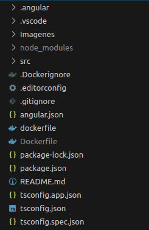

# **Funcionalidad del código**
- Instalar bootstrap con: npm install bootstrap y adicionalmente añadir @import "~bootstrap/dist/css/bootstrap.min.css"; en style.css
- Instalar angular/common/http para el uso de HttpClientModule: npm install @angular/common@latest
- Instalar angular material: ng add @angular/material
- Instalar angular/cdk: npm i @angular/cdk

Nota: usar: **ng s** en la terminal para compilar el proyecto

# **Conexión a la api hecha en node js con servicios de angular**
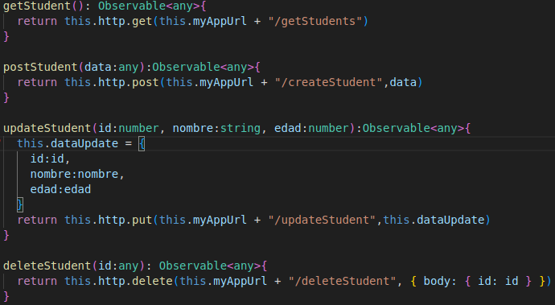

Estos son los servicios que se usan en angular para conectar a ĺa api de nodejs(Framework cuyo readme se encuentra haciendo click aquí:https://github.com/sicalo330/finalOSBackend)

# **Tabla de estudiantes**

# Obtener estudiantes

A continuación el html que le da la estructura a la tabla que obtiene la inforamación de los estudiantes

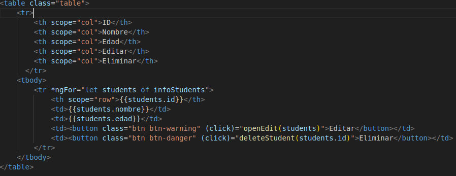

La función ngOnInit, se llama inmediantamente cuando la aplicación cargué completamente, lo que hace es acceder a la api de node js y hace una consulta 'select * from estudiantes' para obtener una lista de estudiantes, que está representado con data, este último es asignado a una variable llamada infoStudents, este es un array de arrrays que contienen los datos de los estudiantes de la base de datos, se utiliza *ngFor para ciclar en cada array y añadir lso datos, por ejemplo {{students.nobre}}

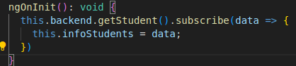

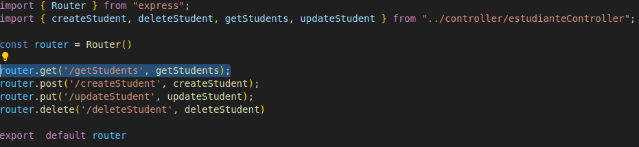
El servicio de angular hace una conexión a la URL localhost:4041/getStudents en la carpeta que contiene las rutas de nodejs, se hace un llamado a una función llamada getStudents

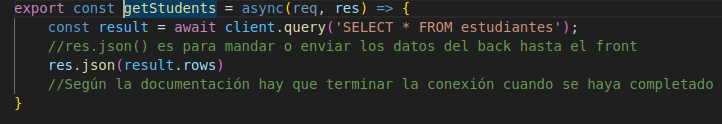

Como se puede apreciar, se obtienen los datos con req.body y con esos datos se hace una consulta con el query SELECT * FROM estudiantes; que llama a postgresql a hacer dicha consulta

# Editar estudiantes

**Nota:**Como se puede ver en el html, hay dos botones uno para editar y otro para eliminar, la función de editar llama a una función llamada openEdit()

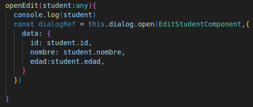

Open Edit abre un modal de angular para añadir los campos de nombre y edad, se envian los datos del estudiante al que se le hizo click al comoponente edit-student, el método open(EditStudentComponent) envía los datos al componente indicado

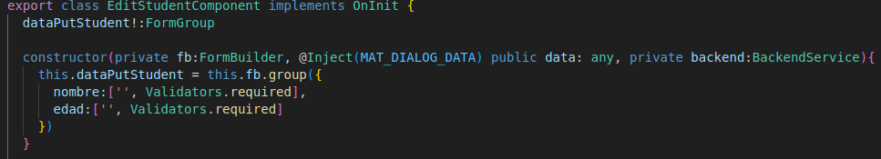

@Inject lo que hace es traer los datos cuando se abre el modal, para que se muestren en los inputs del modal

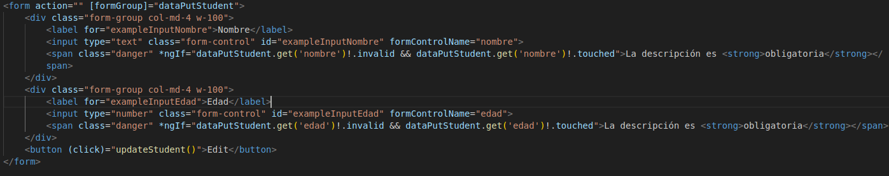

Este es el formulario que le da estructura al formulario del modal que se abre cuando se da al boton actualizar en la tabla de estudiantes, el boton edit llama a la función updateStudent()
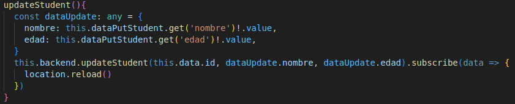

Este hace un llamdo a los servicios de angular y se conecta al localhost:4041/updateStudent

Lo que hace updateStudent() es enviar los datos como nombre y edad junto con el id del estudiante para hacer una actualización de la información del estudiante.

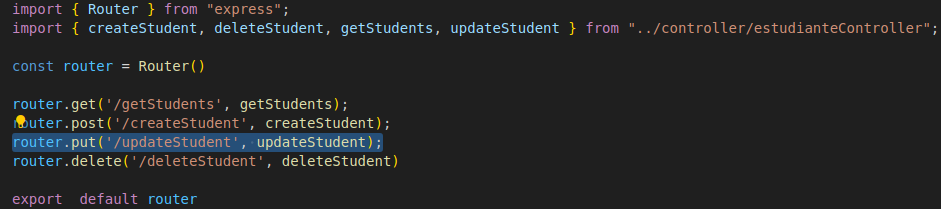

Se hace un llamado a la función updateStudent

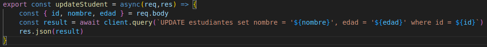

Este método llama postgresql a hacer un UPDATE de la base de datos tomando datos como el nombre, la edad y la id del estudiante al que se desea actualizar los datos,

# Crear estudiantes

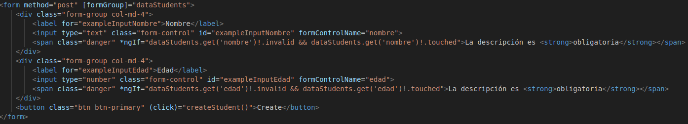
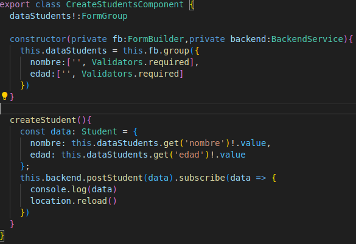

Lo que hace el boton crear estudiante, es tomar la información del formulario creado con las librería FormBuilder, FormGroup y Validators, al obtener todos los datos estos se envían a node js para insertarlos en la base de datos, y por lógica, al cargar la página una vez más se hace una llamada a la base de datos para obtener la información, esto hace parecer que se agregó la información de forma inmediata

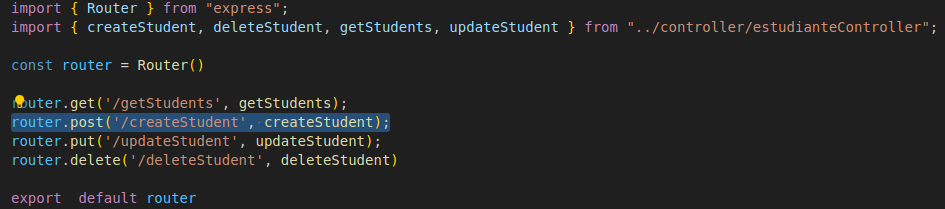

Se hace la llamada a la función createStudent

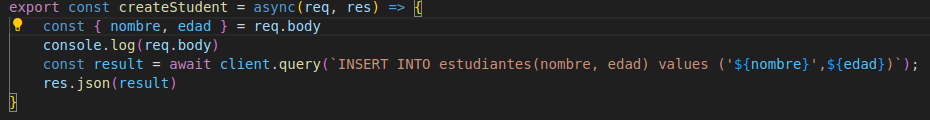

Se hace una inserción a la base de datos de posgresql con INSERT

# Eliminar estudiantes

En la tabla estudiantes, el boton eliminar obtiene la id del estudiante y se envía a nodejs para eliminar el estudiante correspondiente a la id

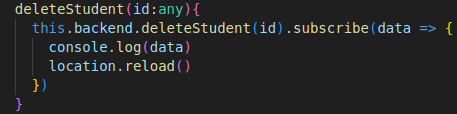

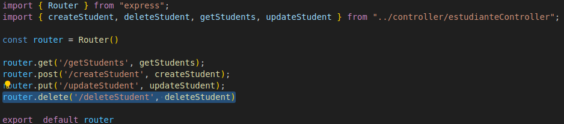

La ruta deleteStudent hace un llamado a la función del mismo nombre

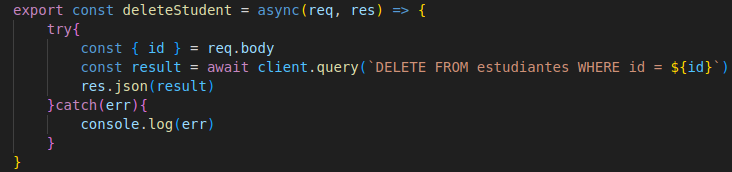

Obtiene la id del estudiante para usar DELETE para borrar el registro de ese estudiante mediante su id

# **Crear entorno para Nodejs**

crear una carpeta llama src para un mejor orden y dentro crear app.js e index.js, similar a lo que se verá

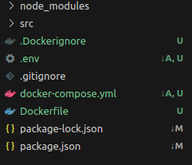

- instalar las dependencias con este comando: npm install @babel/core@^7.24.6 @babel/node@^7.24.6 @babel/preset-env@^7.24.6 babel@^6.23.0 babel-cli@^6.26.0 bootstrap@^5.3.3 cors@^2.8.5 dotenv@^16.4.5 express@^4.19.2 mssql@^10.0.2 mysql@^2.18.1 nodemon@^3.1.1 pg@^8.11.5

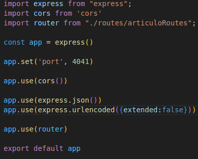

- Es necesario importar las dependencias necesarias entre ellas express, este le da mayores características a nodejs, como el manejo de rutas y métodos GET, POST, PUT, DELETE
- Cors: Permite que un sitio web solicite y reciba datos de otro sitio web, incluso si ambos sitios web tienen diferentes dominios (por ejemplo, https://www.ejemplo.com y https://www.otroejemplo.com)
- La otra importanción son las rutas que se manejaron anteriormente

Se crea una instancia de Express llamada app, este va a usar cors y las rutas ya mencionadas, se le asigna un puerto, en este caso el puerto 4041 y se exporta, yua que app se usará en inde.js

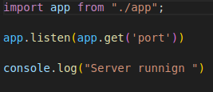

index.js lo que hace es decirle que a app.js que escuche en el puerto 4041 y de paso un console.log() para decirle al desarrollador que la conexión se hizo de forma satisfactoria

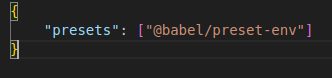

Esto permite a nodejs identificar las nomenclaturas viejas o modernas de javaScript como la importación ES6 sin errores de código

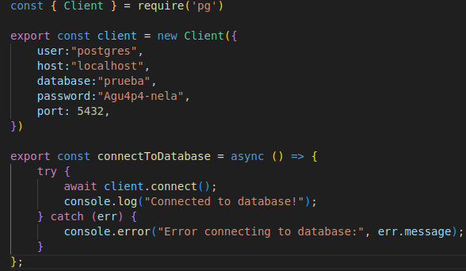

Esto permite a node conectarse con postgresql añadiendo las credenciales como el nombre del usuario, la contraseña, el nombre de la base de datos, etc

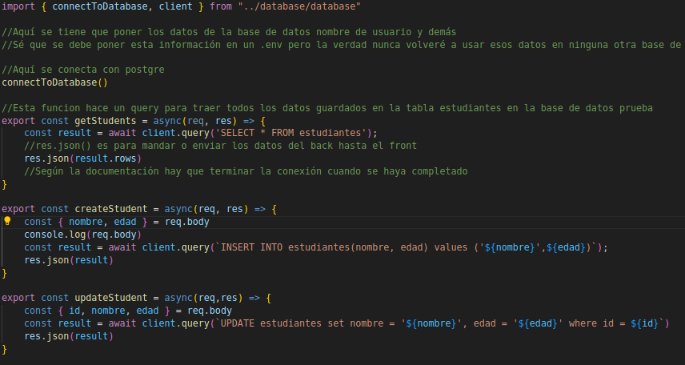

Toma el método planteado anteriormente, para agregarlo en el archivo del controlodor, lo que hace este, es simplemente conectar definitivamente la app a postgresql, de esta forma podrá hacer las consultas o acciones a la base de datos   

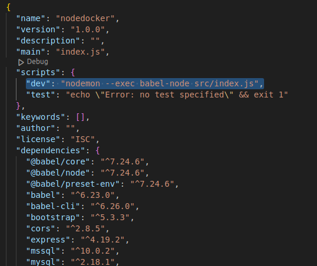

Para compilar el código es necesario agregar la línea al package json, **Nota: la terminal debe estar dentro de la raíz para que le comando se ejecute bien**
Posteriormente agregar el comando **npm run dev**

# Cómo correr el contenedor frontend**

**Para ello es necesario tener docker y angular instalado, posteriormente hay que tener el archivo dockerFile o como mínimo tener el contenedor en la pc y ejecutar el siguiente comando**

- docker run -p puertoPc:puertoDocker nombreContenedor
- Ejemplo: dokcer run -p 4200:4200 sicalo330/finalosfront

# **Referencias**

- https://developer.mozilla.org/es/docs/Web/JavaScript
- https://www.freecodecamp.org/espanol/news/ventajas-y-desventajas-de-javascript/
- https://www.hackaboss.com/blog/diferencias-javascript-java
- https://es.wikipedia.org/wiki/Angular_(framework)
- https://es.wikipedia.org/wiki/PostgreSQL
- https://aws.amazon.com/es/what-is/restful-api/
- https://www.digitalocean.com/community/tutorials/how-to-install-and-use-docker-on-ubuntu-20-04
- https://www.digitalocean.com/community/tutorials/how-to-install-node-js-on-ubuntu-20-04

